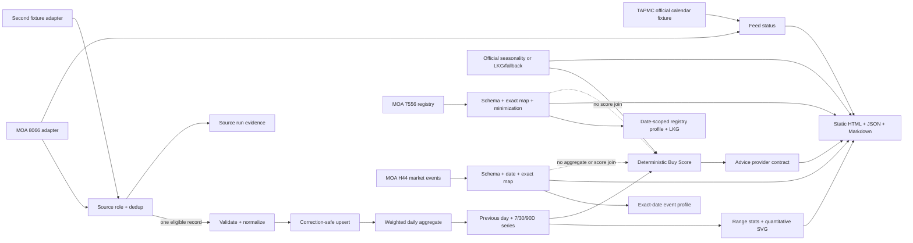

# Taiwan Produce Watch｜台灣蔬果行情觀察

[](https://github.com/trionnemesis/tw-agri-copilot/actions/workflows/ci.yml)
[](https://github.com/trionnemesis/tw-agri-copilot/actions/workflows/deploy-pages.yml)


[](https://github.com/trionnemesis/tw-agri-copilot/releases/tag/v1.0.0)

> 把每日批發市場行情、當季脈絡與可解釋 Buy Score，整理成一個可重建、可追溯的靜態採買情報原型。

**[開啟 GitHub Pages](https://trionnemesis.github.io/tw-agri-copilot/)** · [快速開始](#快速開始) · [功能](#原型功能) · [資料流程](#資料流程) · [排程](#自動更新排程) · [信任邊界](#資料信任邊界) · [驗證](VERIFICATION.md)

## Why

「今天吃什麼」不該只靠一個價格數字。Taiwan Produce Watch 將 20 項台灣常見蔬果的市場資料轉成前一交易日、7／30／90 日趨勢、coverage、deterministic range statistics、產季與 deterministic Buy Score；品項頁再把同一份時間序列轉成有價格／日期刻度、最新值、參考均價與區間高低點的量化 SVG。AI 層只負責解釋，不能改寫數字、分數或 verdict。

本專案目前是 **side-project prototype**。行情、官方市場日曆、產季與產銷履歷各自保存來源狀態；臺北一／臺北二使用已驗證的臺北農產年度休市日曆，產季可抓取農糧署完整月份清單，並以 22 縣市產季地圖分開呈現「官方產期明列的當地品項」與「已保存官方證據的果菜批發市場」。產銷履歷則分成農業部 7556 隱私最小化 registry snapshot 與 H44 市場事件證據。7556 與 H44 都保存日期限定 snapshot，historical build 不會直接重用未來的 `current`。暫時性故障才沿用符合相同資料語意的 last-known-good 或明確標示的 fixture／manual fallback。Advice 仍使用 deterministic fallback，因此它不是完整的即時官方服務。

> **價格邊界：批發市場平均行情，非實際零售通路售價。**

## 原型功能

| Slice | 已完成的原型能力 | 關鍵邊界 |
|---|---|---|
| PR 1 · Foundation | 精確 watchlist mapping、ROC 日期、correction-safe upsert、交易量加權日價、歷史保留 | live 120-day pull 尚未作 release 驗證 |
| PR 2 · Analytics | 前一有效交易日、7／30／90D、coverage、20 個品項頁、日／週／月／季頁與 SVG chart fallback | coverage 不足時不產生正向判定 |
| PR 3 · Recommendation | manual seasonality adapter、Buy Score、首頁推薦卡、price movers | 產季／市場數／7D／30D／品質是 hard gates |
| PR 4 · Advice | provider-neutral input、strict zh-Hant schema、guardrails、deterministic fallback | AI 只能解釋既有 evidence，不能改數字或 verdict |
| Issue #3 · Traceability PR A | 農業部 7556 bounded adapter、schema／pagination 驗證、exact mapping、active／expired、date-scoped LKG、粗粒度縣市與來源 profile | 生產者姓名、精確地址、地段地號、通路與作業明細不發布；履歷不加入 Buy Score |
| Issue #3 · Traceability PR B | 農業部 H44 單日 bounded adapter、strict schema／日期／數值／分頁驗證、exact crop mapping、exact-date event evidence 與獨立 Pages 頁面 | 溯源代號不等於 7556 履歷碼；金額／交易量不併入 8066 aggregate，也不改 Buy Score |
| Issue #8 · Live seasonality | 農糧署 HTML adapter、完整分頁、月份 catalog、LKG／fallback、完整當季清單 | 只做明確名稱 mapping；不做 fuzzy mapping |
| Issue #19 · Produce icons | 專案自有 SVG sprite、41 個顯示名稱的 exact registry（跨月份聯集）、分類 fallback、列印與 responsive 樣式 | 圖示是裝飾性提示；文字名稱仍是唯一語意來源 |
| Issue #30 · County season map | 內政部國土測繪中心 22 縣市界線衍生 SVG、exact county aggregation、verified official-market registry、靜態 no-JS sections、URL／鍵盤／touch 操作 | 產期與市場 metadata 分區呈現；品項數不是產量，市場所在地不證明成交品產地 |
| Issue #40 · Quantitative price trends | 7／30／90D range stats、價格／日期刻度、最新價、7D／30D 參考均價、30D high／low、coverage／CV 摘要與 desktop/mobile browser verification | 純描述統計；不插值、不把休市／缺資料補 0、不做價格預測、不改 Buy Score |
| Issue #3 · Official calendar | 臺北農產 115 年休市日曆、臺北一／臺北二 market registry、calendar／feed 分離與 discrepancy 狀態 | 日曆不加入行情 aggregate 或 Buy Score；未知年度不宣稱官方休市 |
| Issue #3 · Source contract 2A | 通用 `SourceAdapter`／`RawBatch`、四種交易來源角色、run lineage 與 economic-observation dedup | 目前只有 8066 是 production `authoritative_final`；第二 adapter 僅為離線 fixture，TAPMC parity 等後續市場來源切片尚未啟用 |

首頁核心內容、當季圖示與 22 縣市地圖 detail sections 不依賴 JavaScript；JS 只提供當季搜尋／篩選、地圖選取、URL 狀態同步、焦點移動與列印。地圖另提供 visible `<select>`，桌機、手機 touch 與鍵盤操作共用同一 county slug；停用 JS 時仍可用 SVG anchor 閱讀全部縣市。品項價格圖同樣在 build-time 產生靜態 HTML／SVG，不需要 browser-side fetch 或 chart CDN。桌機／平板／手機採 responsive cards。

## 資料流程



Build 只從已保存的 normalized history 重算，不從生成後的 HTML 或 aggregate history 反推資料。`data/`、`site/`、`reports/` 以 staging + rollback promotion 一次更新。量化價格圖只消費 `data/series/*.json` 的 deterministic 衍生欄位與有效 daily observations；缺資料或休市不插值、不補 0。

產季地圖只消費同一份月份 catalog、checked-in county registry、checked-in 官方市場 registry 與人工審查的簡化 SVG；瀏覽器不連外抓地圖、GeoJSON 或行情。衍生 payload 固定寫入 `site/data/season-map/current.json`，不擴張 `site/data/current.json`，因此相同 input 下原有 aggregate、features 與 Buy Score 不變。

交易 adapter 先產生帶 lineage 的 observation；policy 以 `(transaction_date, market_code, crop_code, dataset_semantics)` 作 economic identity。只有唯一的 `authoritative_final` 可標記 `eligible_for_aggregate=true`，其他 provisional／validation／contextual observation 只保留為 evidence。同優先序的不同正式來源在相同 economic identity 競爭時 fail closed，不會以 `source_id` 擴充 key 後直接相加。7556 是獨立的 `authoritative_registry`，不會進入上述行情 resolution 或聚合。

產銷履歷 live refresh 以 `$top`／`$skip` bounded pages 擷取，檢查 HTTP、Content-Type、JSON collection、18 個官方欄位、重複頁、最大頁數與內容 hash。公開 snapshot 只保留追溯碼、公開經營業者／組織代碼、品項、縣市、包裝日、驗證機構與有效日期；同一追溯碼只能有一份一致紀錄。來源暫時失敗時可沿用同來源 LKG 並依 requested date 重新計算 `active | expired | unknown`；schema drift、追溯碼衝突或原始筆數低於 LKG 80% 時不覆寫既有資料。historical build 優先讀 exact-date rows/profile，找不到才使用該日期 deterministic fixture，不直接讀取未來 `current`。

H44 refresh 以單一 `StartDate`／`EndDate` 加 `$top`／`$skip` 擷取，保留交易日期、市場、作物、交易金額、交易量與官方「溯源代號」。每列以完整官方欄位 hash 作事件 identity，只去除完全相同的重複列；不同金額或交易量仍是不同事件。H44 是單日事件證據，因此只允許同 requested date 的 live／stale LKG；跨日期上游失敗不會把前一日事件改標成今日事件。所有事件固定 `eligible_for_market_aggregate=false`、`affects_buy_score=false`，也不嘗試以溯源代號連接 7556 `Tracecode`。官方資料說明：[H44](https://data.moa.gov.tw/open_detail.aspx?id=H44)；registry 說明：[7556／063](https://data.moa.gov.tw/open_detail.aspx?id=063)。

首頁會分開顯示「今日資料檢查」與「最近完整交易日」。`calendar.schedule_status` 與 `feed_status` 分開保存：預期開市但 feed 空白時不會誤標休市，日曆與交易資料衝突時會顯示 `calendar_feed_discrepancy`。網站會保留最近完整交易日，不把舊日期冒充成今日行情；相同證據也會寫入 `site/data/current.json` 的 `publication_status`。

## 自動更新排程

GitHub Actions 是資料抓取、建置、驗證、commit 與 GitHub Pages 發布的唯一自動化執行層。外部 ChatGPT 排程預設只做事後驗證；只有在 primary 與 internal guard 都沒有產生 run、目前沒有 queued／in-progress Daily run、publication 已落後今日，而且能確認 recovery-capable push run 時，才可作為 bounded recovery actuator，**唯一允許的動作是 re-run 既有 GitHub Actions `update` job**。ChatGPT 不自行抓取或寫入行情／7556／H44，不推測休市，也不能改寫 Buy Score。完整契約見 [`docs/EXTERNAL_RECOVERY.md`](docs/EXTERNAL_RECOVERY.md)。

`GITHUB_TOKEN` 的 push 不會觸發新的 workflow run，因此每日資料 commit 不會啟動 `ci.yml`。發布路徑改為自我驗證：`update` job 在 commit 之前執行完整測試套件與 repository size gate，並比對測試前後的工作樹；只要測試動過工作樹就 fail closed，不會把 fixture 當成 live 資料發布。`ci.yml` 另外每日排程執行一次，讓 `main` 的健康狀態不只在有人 push 時才被檢查。

| 時間 / 觸發 | 行情 8066 | 產季 | 7556 registry | H44 單日事件 | 發布 |
|---|---|---|---|---|---|
| 每日 09:17 Asia/Taipei | bounded refresh；資料未完整時解析最近可發布交易日 | 同月份 live snapshot 可直接重用 | 更新 / 驗證；即使只有 fixture context 也保存當日 exact-date evidence | 不主動抓取；當日無 live exact-date snapshot 時安全使用當日 fixture context | build、validate、Pages deploy |
| 每日 18:17 Asia/Taipei | bounded refresh | 同月份 cache policy | 更新 / 驗證；保存當日 exact-date evidence | 更新當日 exact-date event snapshot | build、validate、Pages deploy |
| 09:47／18:47 internal recovery guard | 不直接抓資料；只檢查對應 primary scheduled run 是否存在 | 同左 | primary run 完全不存在時，以同 requested date dispatch recovery | morning recovery 跳過；evening recovery 執行 | 沿用同一 build、validate、Pages workflow |
| 10:30／19:30 external verifier / bounded actuator | 平時唯讀；primary 與 guard 都缺失且 publication stale 時，只 re-run recovery-capable push `update` job | 由 rerun 後的 GitHub Actions 依正常 policy 處理 | 由 GitHub Actions 產生 requested-date exact-date evidence | 10:30 recovery 必須跳過；19:30 recovery 才執行 | GitHub Actions 完成 build、validate、commit、Pages deploy；ChatGPT 不直接寫資料 |
| `workflow_dispatch` | 可指定日期與 backfill | 可強制安全 refresh | 更新指定日期 context | 更新指定日期 exact-date event snapshot | build、validate、Pages deploy |
| `main` 的 source/config/workflow push attempt 1 | 不對外抓取 | 不對外抓取 | 不對外抓取 | 不對外抓取 | 只以 committed evidence 重建並驗證 |
| recovery-capable push rerun attempt > 1 | 僅在 publication stale 且 10:00–13:59／19:00–22:59 Asia/Taipei 才轉為 recovery | 沿用 scheduled policy | 更新今日 exact-date evidence | morning 跳過；evening 執行 | 沿用正常 build、validate、commit、Pages deploy；其他時段仍維持 committed-evidence-only |

排程刻意不在 09:17 抓 H44：H44 是單日事件證據且不影響 Buy Score，晚間再擷取可降低把早盤／未完整事件集合誤當成當日證據的風險。09:17／18:17 刻意避開整點，以降低 GitHub Actions scheduled workflow 在高負載整點延遲或未入列的風險。若 H44 跨日期抓取失敗，系統回報 unavailable／fixture context，不把前一日事件搬成今日 stale。

GitHub scheduled event 是 best-effort；因此 recovery guard 於 primary slot 後 30 分鐘查詢 `Daily market update` 歷史。只要同一時段已有 `schedule` run（不論 queued、in progress、success 或 failure），guard 就不重複觸發；只有 run 完全不存在時，才以 repository `GITHUB_TOKEN` 建立可稽核的 `morning-recovery`／`evening-recovery` `workflow_dispatch`。API 查詢或日期判定失敗時 guard fail closed，不猜測、不 dispatch。這層降低單一 cron event 遺失的風險，但 internal guard 本身仍與 primary 共用 GitHub scheduler failure domain。

外部 verifier／actuator 提供第三層、不同排程 failure domain 的 recovery。若 primary 已存在（包括 failure）或 internal guard 已建立 recovery，外部 verifier 不得再觸發第二次；只有兩層 run 都完全缺失、沒有 Daily run 正在 queued／in progress、publication requested date 早於今天，並確認 current main 已包含 out-of-band rerun contract 時，才可 re-run 一個使用該 workflow 版本且已成功完成的 push `update` job。rerun 必須由 GitHub runner 自己重新計算 Asia/Taipei 今日日期、抓官方來源、產生 7556 exact-date evidence、build／validate／commit／deploy；10:30 morning recovery 跳過 H44，19:30 evening recovery 才執行 H44。只有新 attempt、main publication、Pages deployment 與 artifact/repo 一致性全部驗證通過後才能標記 recovered green。

## 快速開始

需求：Python 3.11+；prototype build 不需額外套件或 API key。

```bash
git clone https://github.com/trionnemesis/tw-agri-copilot.git
cd tw-agri-copilot

PYTHONPATH=src python3 -m tpw validate-config
PYTHONPATH=src python3 -m tpw validate-market-calendar --year 2026
PYTHONPATH=src python3 -m tpw seed-prototype --as-of 2026-08-25
PYTHONPATH=src python3 -m tpw build --as-of 2026-08-25
PYTHONPATH=src python3 -m tpw.presentation
PYTHONPATH=src python3 -m tpw validate-data --as-of 2026-08-25
PYTHONPATH=src python3 -m tpw validate-traceability
PYTHONPATH=src python3 -m tpw validate-traceability-events
PYTHONPATH=src python3 -m tpw verify-site --as-of 2026-08-25

python3 -m http.server 8000 --directory site
```

開啟 `http://localhost:8000/`。第二次執行相同 seed/build 會產生相同內容 hash。

一般 build 不需要額外套件。只有受控更新官方 PDF fixture 時，才需先執行 `python3 -m pip install -e '.[calendar]'`，再執行 `PYTHONPATH=src python3 -m tpw refresh-market-calendar --year 2026`；文件 hash、格式、日期總數或 parser contract 不符時不會覆寫 last-known-good fixture。

縣市邊界不屬每日更新。只有在獨立審查的 geometry PR 中，才以 pinned 官方 archive 執行 `python3 tools/generate_county_svg.py --source /path/to/COUNTY_MOI_1140318_.zip --output src/tpw/assets/taiwan-counties.svg --check`；工具會同時驗證官方 archive 與衍生 SVG hash，任何差異都 fail closed。

## CLI

| Command | 用途 |
|---|---|
| `validate-config` | 驗證 10 水果 + 10 蔬菜 mapping，以及 county／official-market／boundary lineage／SVG 契約 |
| `validate-market-calendar --year YEAR` | 驗證 normalized calendar、365／366 日完整性、market registry 與來源 hash |
| `refresh-market-calendar --year YEAR` | 受控下載及解析已核准的臺北農產年度 PDF；hash／格式漂移時 fail closed |
| `validate-agent-run PATH [PATH ...]` | 驗證 proposed Agent Run JSON 契約；不執行分析或發布 |
| `seed-prototype --as-of DATE` | 建立 35 日、2 市場、20 品項的 deterministic fixture history |
| `fetch-market --start DATE --end DATE` | 透過 8066 `SourceAdapter` 抓取 bounded batch，完成來源解析後保存 normalized watchlist data 與 source-run evidence |
| `fetch-seasonality --month YYYY-MM` | 抓取並驗證農糧署水果／蔬菜完整分頁；暫時性故障使用 LKG／fallback |
| `refresh-seasonality --month YYYY-MM [--force]` | 依月份 cache policy 重用或更新產季；`--force` 只略過同月 live reuse，不略過來源與 LKG 驗證 |
| `fetch-traceability --as-of DATE` | 受控更新農業部 7556 registry；暫時失敗使用同來源 LKG 並依 requested date 重算有效性，契約／品質漂移 fail closed |
| `validate-traceability` | 驗證公開 registry、source profile、唯一追溯碼、有效狀態與禁止欄位 |
| `fetch-traceability-events --as-of DATE` | 受控更新農業部 H44 單日市場事件；只有同 requested date 的 LKG 可 stale，跨日期失敗不搬用舊事件 |
| `validate-traceability-events` | 驗證 H44 事件、source profile、event identity 與 aggregate／Buy Score 排除旗標 |
| `backfill --days N --end DATE` | 以最多 4 日的 bounded windows 抓取市場資料 |
| `build --as-of DATE` | 從 retained normalized history 重建所有衍生資料、range statistics、量化價格 SVG 與網站 |
| `validate-data --as-of DATE` | 驗證 normalized 與 PR2–PR5 衍生資料樹 |
| `verify-site --as-of DATE` | 檢查 routes、links、SVG sprite／fragment、disclaimers、secrets、size 與 prototype gates |

## 公開頁面

| Route | 內容 |
|---|---|
| [`/`](https://trionnemesis.github.io/tw-agri-copilot/) | 推薦、advice、產季、movers、trends、履歷與來源 |
| `/produce/<canonical-id>.html` | 20 個品項的價格量化摘要、最多 120 日刻度折線、7D／30D 參考均價、30D high／low、coverage、CV、score，以及分開呈現的 7556 履歷與 H44 事件 |
| `/trends/daily.html` | 前一有效交易日比較 |
| `/trends/weekly.html` | 7 日 rolling view |
| `/trends/monthly.html` | 30 日 rolling view |
| `/trends/quarterly.html` | 90 日 rolling view |
| `/season/current.html` | 本月完整盛產清單、專案自有蔬果圖示、搜尋／分類篩選、產地數與行情／履歷狀態 |
| [`/season/map.html`](https://trionnemesis.github.io/tw-agri-copilot/season/map.html) | 22 縣市互動 SVG、已驗證官方果菜批發市場與本月 exact-match 當地盛產品項；支援 touch、鍵盤、URL state、列印與 no-JS fallback |
| `/traceability/index.html` | 有效履歷批次、驗證經營者、涵蓋品項、來源狀態與 non-join 警示 |
| `/traceability/<canonical-id>.html` | 20 個品項的履歷批次明細；僅部分由索引頁連出，其餘為 URL-only |
| `/traceability/market-events.html` | H44 日期／市場事件、來源狀態、溯源代號原值與 no-aggregate／no-score 警示 |
| `/daily/YYYY/MM/YYYY-MM-DD.html` | 每日靜態快照 |
| `/archive/index.html` | retained history |
| `/methodology.html` | 算法、coverage、fallback 與限制 |

## 資料信任邊界

- Market prototype fixture 是可重現測試資料，不是 live Dataset 8066 snapshot。
- 交易來源角色限為 `authoritative_final | provisional | validation | contextual`；目前農業部 8066 的 precedence 為 100 且是唯一 production `authoritative_final`。非 final 角色一律不得進 aggregate／Buy Score。
- `data/source-runs/` 保存 adapter／source schema version、retrieved time、content hash、precedence、eligible／suppressed count，以及重疊 observation 的 machine-readable 決策。相同 economic identity 最多一筆 eligible；相同 identity 的不同正式來源同優先序時 fail closed。
- 第二種 transaction schema 目前只存在於離線 contract fixture，用來證明 analytics、scoring、render 不依賴來源實作；沒有新增 production scraping，也沒有把 TAPMC 重複行情疊加到 8066。
- 價格量化圖與 `range_stats` 只使用已保存的 8066-derived daily observations；Y 軸依實際觀測範圍產生可讀刻度，coverage 不足明確標示 `insufficient`，休市／缺資料不補 0。high／low、CV 與均價都是 descriptive statistics，不宣稱預測能力，也不改 Buy Score。
- Market calendar 是獨立 `calendar` source：目前只涵蓋臺北一 `109`、臺北二 `104`。115 年 fixture 對應官方 PDF 的 80 個休市日／285 個交易日，保存 document URL、calendar／parser version、retrieved time 與 SHA-256；不以空 feed 或固定週一規則取代 fixture。
- `expected_open | scheduled_closed | exceptional_open | unknown` 與 `available | empty | delayed | failed | not_checked` 分開判定；只有具 fixture lineage 的結果可標示「官方公告休市」。
- Seasonality 優先使用農糧署官方月份清單，逐頁驗證分類、月份與欄位；transient failure 才使用 `stale`／`fallback`，schema drift 直接失敗。
- Watchlist 與官方產季名稱只允許 `config/produce.yml` 的明確對照；`unknown` 不等於非當季。
- 當季圖示只依 `(category, display_name)` exact registry 選取；`representative` 代表同類代表圖，未知名稱只使用水果／蔬菜分類 fallback，不做 fuzzy matching。農糧署月份清單會輪替，registry 因此是跨月份的聯集而非單月快照；未涵蓋的名稱由每日排程以 job summary 與 `::warning::` 回報，不阻擋當日行情發布。SVG paths 為本專案新作並隨站點發布，不在 runtime 讀取第三方資產、CDN 或 data URI。
- 當季圖示標記為裝飾性 `aria-hidden`；可存取名稱與搜尋文字一律沿用已轉義的蔬果文字名稱。
- 縣市地圖幾何由[內政部國土測繪中心 2025「直轄市、縣市界線（TWD97經緯度；COUNTY_MOI_1140318）」](https://data.gov.tw/dataset/7442)官方 GML 於每日 build 之外受控轉換；依[政府資料開放授權條款第1版](https://data.gov.tw/license)使用，本 SVG 為簡化及 inset 排版衍生物。原始 archive hash、geometry hash、轉換參數、版本與 attribution 保存於 `config/map-boundary-source.json`；每日排程不會下載或覆寫邊界。
- `config/county-registry.json` 與 SVG path 必須一對一涵蓋 22 縣市；產期縣市只做人工審查 alias 的 exact match。unknown source county 只列入 `unmapped_source_counties`，不做 fuzzy 或行政區反推。
- `config/official-produce-markets.json` 是 `verified_entries_only` metadata registry；目前臺北一 `109`、臺北二 `104` 逐筆保存臺北農產官方證據。未收錄表示「registry 尚未完成驗證」，不表示該縣市沒有市場。
- **「產地產期」與「批發市場成交」是不同資料語意。市場位於該縣市，不代表成交品項產自該縣市；地圖品項數不是產量、面積或市場供應量。**
- Advice 預設為 `deterministic_fallback`，provider 只接收已驗證 metrics、score 與 reason codes。
- Traceability registry 的 source role 固定為 `authoritative_registry`；只允許 `config/produce.yml` 的 display name／explicit aliases，不做 fuzzy mapping，也不把 `canonical_id` 當成 live upstream 欄位。
- `data/traceability/source-profile.json` 保存 adapter／schema version、擷取時間、content hash、raw／published／active／expired／unknown／unmapped／missing／duplicate counts；`data/traceability/daily/` 與 `data/traceability/profiles/` 保存 exact-date evidence。原始筆數低於前次 live／stale LKG 的 80% 時拒絕 promotion。
- 公開履歷只保留追溯碼、公開經營業者／組織代碼、品項、粗粒度縣市、包裝日、驗證機構與有效日期。`FarmerName`、`StoreInfo`、精確地址、`LandSecNO`、栽種／履歷／加工明細與一籤一碼清單均不發布。
- `valid_date < as_of_date` 明確標示 `expired`，不計入有效履歷批次；缺少有效日標示 `unknown`，也不計入 active count。stale registry 會依本次 requested date 重新計算，不沿用舊 active count。
- **此為同品項的公開產銷履歷紀錄，非本日市場成交來源證明。**
- H44 source role 固定為 `authoritative_market_event`、dataset semantics 固定為 `traceability_market_event`。事件與 7556 registry lot、8066 `authoritative_final` observation 分開保存；`data/traceability/market-events/source-profile.json`、`daily/`、`profiles/` 與每列都明確禁止 aggregate／Buy Score。
- H44 日期必須等於 requested date；只有相同 requested date 的 LKG 可標示 stale。空白、HTML、非 JSON、schema drift、日期漂移、非法數值、重複頁、超出頁數或 LKG 80% count gate 都 fail closed。
- **H44 溯源代號只按官方欄位原值顯示，不推論 7556 `Tracecode`，也不證明本站 8066 當日成交來源。**
- 測試套件不寫入 `data/`、`site/`、`reports/`：驅動 CLI 的測試在暫存的 repository 副本上執行，`ci.yml` 與每日排程都會比對測試前後的工作樹。
- 不提交上游全量 dump、credentials、`.env`、private keys 或 base64 圖片。

## Repository anatomy

```text
config/                 watchlist、county／official-market registry、map lineage、calendar 文件契約、score、fixture 與 fallback 設定
src/tpw/                adapters、normalization、analytics、trend_quant、score、advice、season-map、render、CLI 與圖示 registry
src/tpw/assets/         專案自有 SVG sprite 與受控簡化的臺灣縣市 SVG 原始資產
data/                   normalized history、source-run evidence、月份產季 catalog、產銷履歷 registry／H44 market-events、Agent Run 寫入區與可重建的衍生 JSON
data/market-status/     最近一次市場日檢查與休市／延遲狀態
data/market-calendar/   已驗證的官方年度 normalized calendar fixture
data/source-runs/       transaction adapter lineage 與 economic-observation resolution evidence
data/traceability/daily/         7556 exact-date 公開 registry snapshot
data/traceability/profiles/      7556 exact-date source profile
data/traceability/market-events/daily/     H44 exact-date event snapshot
data/traceability/market-events/profiles/  H44 exact-date event profile
schema/                 Agent Run、market calendar、source-run、season-map、county／official-market／map-boundary 與 traceability JSON Schema
site/                   GitHub Pages 靜態成品；含獨立 `data/season-map/current.json`
reports/                每日 Markdown 快照
tests/                  unit、contract、integration 與 Playwright browser tests
tools/                  人工審查用、非每日排程的 deterministic county SVG 轉換器
.github/workflows/      fixture CI、daily update、scheduler recovery guard、Pages deploy
docs/                   外部 recovery actuator 契約
references/             hash-pinned 視覺參考輸入；不進入 build
SPEC.md                 完整產品／資料契約
VERIFICATION.md         本地與遠端 acceptance evidence
```

## 狀態

- Release v1.0.0：Issue #44 Part A 的 D-1（圖示 registry 綁定輪替中的上游清單）、D-2（每日資料 commit 沒有 CI 覆蓋）、D-3（測試污染已發布內容）均已修正，並各自留下回歸保護。變更紀錄見 [`CHANGELOG.md`](CHANGELOG.md)。
- Prototype fixture：可重建、可測試、可部署。
- Live market adapter：已實作 bounded fetch path；本版未進行 live 120-day release 驗證。
- Quantitative price trends：`data/series/*.json` 已保存 7／30／90D range stats；20 個品項頁以 build-time static SVG 顯示價格／日期刻度、最新價、7D／30D 參考均價、30D high／low、coverage 與 7D CV。fixture rebuild、`verify-site`、unit/integration 及桌機／手機 Playwright 都納入 CI；不做預測、不改 scoring。
- Phase 2A source contract：8066 已移除 ingest／normalize 的來源硬編碼；第二 fixture adapter、四種角色、precedence、去重、supersession evidence 與 schema-drift fail-safe 均有離線測試。TAPMC parity、provisional feed、contextual layer、地方市場擴充與 Buy Score vNext 仍屬後續切片。
- Official market calendar：臺北一／臺北二 115 年 fixture 已實作；calendar／feed 分離、特殊週一開市、非週一休市、未知年度與 discrepancy 均有離線測試。
- External AI provider：未啟用；固定走 deterministic fallback。
- Seasonality：官方 HTML adapter 已實作並保存月份 catalog；同月份 live snapshot 可重用，Actions 手動執行可要求安全強制更新，失敗狀態明確標示。
- Produce icons：完整當季頁以 exact registry 選取本地 sprite symbol，未知品項安全降級為分類 fallback；不改變公開 JSON、搜尋或資料判定。
- County season map：22 縣市 registry／SVG 一對一、臺北 104／109 official evidence、exact county aggregation、responsive／keyboard／touch／no-JS UI 與獨立 payload 已納入 deterministic build；不新增 runtime map API、地方市場 scraper 或 Buy Score join。
- Traceability PR A：7556 live registry adapter、bounded pagination、strict schema、exact mapping、privacy minimization、active／expired、date-scoped profile／LKG 與 Pages UI 已合併 `main`。Repository 仍提交小型 fixture 作 deterministic CI；排程成功後才會把狀態標成 `live`，不把 fixture 冒充官方即時快照。
- Traceability PR B：H44 單日 bounded adapter、strict contract、exact mapping、event identity、exact-date cache、獨立 schema／JSON／Pages 證據已合併 `main`。H44 不併入 8066 aggregate 或 Buy Score，也不冒充 7556 履歷碼。
- Automation：GitHub Actions 09:17／18:17（Asia/Taipei）負責市場與 Pages 發布；7556 兩次檢查，H44 僅 18:17／手動／evening recovery 更新。09:47／18:47 internal guard 只在對應 primary run 完全不存在時 dispatch bounded recovery；外部 ChatGPT 10:30／19:30 預設 verifier，僅在 primary 與 guard recovery 都缺失、沒有 Daily run 執行中、publication stale 且能確認 recovery-capable push run 時，才可 re-run 該 GitHub Actions `update` job。資料抓取、Buy Score、commit 與 Pages 發布仍全部由 GitHub Actions 負責。

視覺語言來自使用者提供的分析型 HTML（navy gradient、paper cards、status badges、responsive grids）；README 資訊架構參考 [AgentSec README.zh-TW](https://github.com/trionnemesis/AgentSec/blob/main/README.zh-TW.md)，但內容與資料邊界皆針對本專案重寫。
