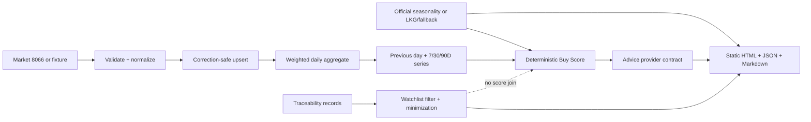

# Taiwan Produce Watch｜台灣蔬果行情觀察

[](https://github.com/trionnemesis/tw-agri-copilot/actions/workflows/ci.yml)
[](https://github.com/trionnemesis/tw-agri-copilot/actions/workflows/deploy-pages.yml)


> 把每日批發市場行情、當季脈絡與可解釋 Buy Score，整理成一個可重建、可追溯的靜態採買情報原型。

**[開啟 GitHub Pages](https://trionnemesis.github.io/tw-agri-copilot/)** · [快速開始](#快速開始) · [功能](#原型功能) · [資料流程](#資料流程) · [信任邊界](#資料信任邊界) · [驗證](VERIFICATION.md)

## Why

「今天吃什麼」不該只靠一個價格數字。Taiwan Produce Watch 將 20 項台灣常見蔬果的市場資料轉成前一交易日、7／30／90 日趨勢、coverage、產季與 deterministic Buy Score；AI 層只負責解釋，不能改寫分數或 verdict。

本專案目前是 **side-project prototype**。行情與產季各自保存來源狀態；產季可抓取農糧署完整月份清單，暫時性故障才沿用 last-known-good 或 manual fallback。產銷履歷與 advice 仍使用 minimized fixture／deterministic fallback，因此它不是完整的即時官方服務。

> **價格邊界：批發市場平均行情，非實際零售通路售價。**

## 原型功能

| Slice | 已完成的原型能力 | 關鍵邊界 |
|---|---|---|
| PR 1 · Foundation | 精確 watchlist mapping、ROC 日期、correction-safe upsert、交易量加權日價、歷史保留 | live 120-day pull 尚未作 release 驗證 |
| PR 2 · Analytics | 前一有效交易日、7／30／90D、coverage、20 個品項頁、日／週／月／季頁與 SVG chart fallback | coverage 不足時不產生正向判定 |
| PR 3 · Recommendation | manual seasonality adapter、Buy Score、首頁推薦卡、price movers | 產季／市場數／7D／30D／品質是 hard gates |
| PR 4 · Advice | provider-neutral input、strict zh-Hant schema、guardrails、deterministic fallback | AI 只能解釋既有 evidence，不能改數字或 verdict |
| PR 5 · Traceability | watchlist filtering、nullable fields、粗粒度縣市、品項與履歷頁 | 履歷不加入 Buy Score，也不代表本日成交來源 |
| Issue #8 · Live seasonality | 農糧署 HTML adapter、完整分頁、月份 catalog、LKG／fallback、完整當季清單 | 只做明確名稱 mapping；不做 fuzzy matching |

首頁核心內容不依賴 JavaScript；JS 只提供當季篩選與列印。桌機／平板／手機採 3／2／1 欄 responsive cards。

## 資料流程



Build 只從已保存的 normalized history 重算，不從生成後的 HTML 或 aggregate history 反推資料。`data/`、`site/`、`reports/` 以 staging + rollback promotion 一次更新。

首頁會分開顯示「今日資料檢查」與「最近完整交易日」。官方資料標示休市、行情尚未完整或來源暫時不可用時，網站會保留最近完整交易日並顯示對應狀態，不會把舊日期冒充成今日行情；相同狀態也會寫入 `site/data/current.json` 的 `publication_status`。

## 快速開始

需求：Python 3.11+；prototype build 不需額外套件或 API key。

```bash
git clone https://github.com/trionnemesis/tw-agri-copilot.git
cd tw-agri-copilot

PYTHONPATH=src python3 -m tpw validate-config
PYTHONPATH=src python3 -m tpw seed-prototype --as-of 2026-08-25
PYTHONPATH=src python3 -m tpw build --as-of 2026-08-25
PYTHONPATH=src python3 -m tpw validate-data --as-of 2026-08-25
PYTHONPATH=src python3 -m tpw verify-site --as-of 2026-08-25

python3 -m http.server 8000 --directory site
```

開啟 `http://localhost:8000/`。第二次執行相同 seed/build 會產生相同內容 hash。

## CLI

| Command | 用途 |
|---|---|
| `validate-config` | 驗證 10 水果 + 10 蔬菜 mapping |
| `validate-agent-run PATH [PATH ...]` | 驗證 proposed Agent Run JSON 契約；不執行分析或發布 |
| `seed-prototype --as-of DATE` | 建立 35 日、2 市場、20 品項的 deterministic fixture history |
| `fetch-market --start DATE --end DATE` | 呼叫 market adapter 並保存 normalized watchlist data |
| `fetch-seasonality --month YYYY-MM` | 抓取並驗證農糧署水果／蔬菜完整分頁；暫時性故障使用 LKG／fallback |
| `refresh-seasonality --month YYYY-MM [--force]` | 依月份 cache policy 重用或更新產季；`--force` 只略過同月 live reuse，不略過來源與 LKG 驗證 |
| `fetch-traceability --month YYYY-MM` | 保存 watchlist-only minimized fixture records |
| `backfill --days N --end DATE` | 以最多 4 日的 bounded windows 抓取市場資料 |
| `build --as-of DATE` | 從 retained normalized history 重建所有衍生資料與網站 |
| `validate-data --as-of DATE` | 驗證 normalized 與 PR2–PR5 衍生資料樹 |
| `verify-site --as-of DATE` | 檢查 routes、links、disclaimers、secrets、size 與 prototype gates |

## 公開頁面

| Route | 內容 |
|---|---|
| [`/`](https://trionnemesis.github.io/tw-agri-copilot/) | 推薦、advice、產季、movers、trends、履歷與來源 |
| `/produce/<canonical-id>.html` | 20 個品項的價格、coverage、score、趨勢與相關履歷 |
| `/trends/daily.html` | 前一有效交易日比較 |
| `/trends/weekly.html` | 7 日 rolling view |
| `/trends/monthly.html` | 30 日 rolling view |
| `/trends/quarterly.html` | 90 日 rolling view |
| `/season/current.html` | 本月完整盛產清單、全部／水果／蔬菜篩選、產地數與行情／履歷狀態 |
| `/traceability/index.html` | watchlist 相關履歷索引與 non-join 警示 |
| `/daily/YYYY/MM/YYYY-MM-DD.html` | 每日靜態快照 |
| `/archive/index.html` | retained history |
| `/methodology.html` | 算法、coverage、fallback 與限制 |

## 資料信任邊界

- Market prototype fixture 是可重現測試資料，不是 live Dataset 8066 snapshot。
- Seasonality 優先使用農糧署官方月份清單，逐頁驗證分類、月份與欄位；transient failure 才使用 `stale`／`fallback`，schema drift 直接失敗。
- Watchlist 與官方產季名稱只允許 `config/produce.yml` 的明確對照；`unknown` 不等於非當季。
- Advice 預設為 `deterministic_fallback`，provider 只接收已驗證 metrics、score 與 reason codes。
- Traceability 只保留 watchlist 所需欄位，移除 farmer/store details，place 降為縣市。
- **此為同品項的公開產銷履歷紀錄，非本日市場成交來源證明。**
- 不提交上游全量 dump、credentials、`.env`、private keys 或 base64 圖片。

## Repository anatomy

```text
config/                 watchlist、score、fixture 與 fallback 設定
src/tpw/                adapters、normalization、analytics、score、advice、render、CLI
data/                   normalized history、月份產季 catalog、Agent Run 寫入區與可重建的衍生 JSON
data/market-status/     最近一次市場日檢查與休市／延遲狀態
schema/                 Agent Run JSON Schema
site/                   GitHub Pages 靜態成品
reports/                每日 Markdown 快照
tests/                  unit、contract、integration tests
.github/workflows/      fixture CI、daily update、Pages deploy
SPEC.md                 完整產品／資料契約
VERIFICATION.md         本地與遠端 acceptance evidence
```

## 狀態

- Prototype fixture：可重建、可測試、可部署。
- Live market adapter：已實作 bounded fetch path；本版未進行 live 120-day release 驗證。
- External AI provider：未啟用；固定走 deterministic fallback。
- Seasonality：官方 HTML adapter 已實作並保存月份 catalog；同月份 live snapshot 可重用，Actions 手動執行可要求安全強制更新，失敗狀態明確標示。
- Traceability：目前仍為明確標示的 minimized fixture；live adapter 尚未實作。

視覺語言來自使用者提供的分析型 HTML（navy gradient、paper cards、status badges、responsive grids）；README 資訊架構參考 [AgentSec README.zh-TW](https://github.com/trionnemesis/AgentSec/blob/main/README.zh-TW.md)，但內容與資料邊界皆針對本專案重寫。
