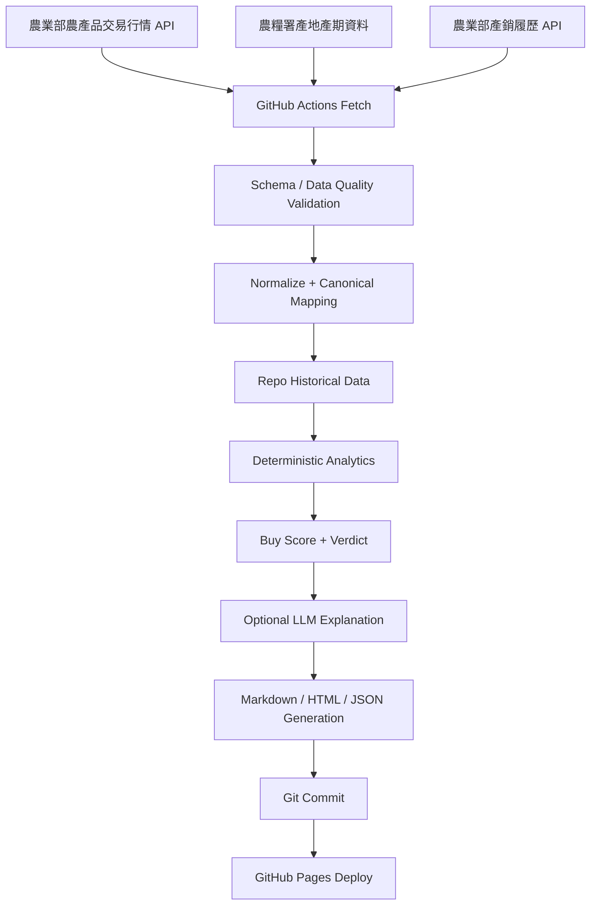

# Taiwan Produce Watch — SPEC 設計文件

## 0. 文件用途與優先級

本文件是 SDD（Spec-Driven Development）流程中的 **規格來源（source of truth）**，供 Claude Code、Codex、Gemini CLI 或其他 AI Agent 產生後續的 `PLAN.md`、`TASKS.md`、實作、測試與驗證報告。

規範性關鍵字：

- **MUST／不得**：強制需求，未滿足即不得視為完成。
- **SHOULD／原則上**：除非有可記錄且可驗證的理由，否則必須遵守。
- **MAY／可**：允許但非必要。

優先級：

- **P0**：MVP 上線前必須完成。
- **P1**：V1 完整功能，P0 穩定後加入。
- **P2**：後續擴充，不得阻塞 P0。

若本文件與實作、README、Issue 或 Agent 推論衝突，以本文件為準。Agent 不得自行擴大產品範圍；未知資訊必須標示為未知，不得補造資料。

---

## 1. Agent 執行契約

執行本 SPEC 的 AI Agent MUST：

1. 完整閱讀本文件後，先產生 `PLAN.md`，再產生可追蹤需求編號的 `TASKS.md`。
2. 每個實作任務 MUST 對應至少一個 `FR-*`、`NFR-*` 或 `AC-*` 編號。
3. 在寫程式前列出資料來源、資料契約、失敗模式與測試策略。
4. 不得把批發市場行情稱為「零售價」。
5. 不得把某日某市場的平均行情直接歸屬於某位農民或某筆產銷履歷。
6. 不得在測試中依賴即時外部 API；必要測試 MUST 使用固定 fixture。
7. 不得將 API Key、Token 或秘密寫入 Git、生成 HTML、console log 或測試快照。
8. 不得因 LLM 呼叫失敗而使網站無法生成；必須提供 deterministic fallback。
9. 不得使用 fuzzy matching 自動建立「市場品項 ↔ 產季品項 ↔ 產銷履歷」正式關聯。
10. 完成實作後產生 `VERIFICATION.md`，逐項回報 Acceptance Criteria 的證據、測試命令與結果。

---

## 2. 產品摘要

### 2.1 產品定位

**Taiwan Produce Watch** 是一個以台灣公開農業資料為基礎的靜態資料產品，透過 GitHub Actions 每日更新，並由 GitHub Pages 顯示：

- 台灣蔬菜、水果的批發市場每日行情；
- 當月當季蔬果；
- 日、週、月、季行情變化；
- 產地與可取得的產銷履歷資訊；
- 由 deterministic score 產生的採買判定；
- 由 AI 將判定證據整理為繁體中文採買說明。

### 2.2 首頁核心問題

使用者進站後，第一個畫面 MUST 優先回答：

> **今天有哪些當季蔬菜水果值得優先採買？為什麼？**

首頁不是統計報表首頁，也不是完整資料查詢入口。推薦採買區必須比總體行情、趨勢圖、產地與歷史封存更早出現。

### 2.3 產品語意邊界

本產品提供的是「批發市場行情與相對趨勢參考」，不是：

- 實際超市、量販店、菜市場或電商零售價；
- 個別攤商售價；
- 食品安全保證；
- 營養或醫療建議；
- 未來價格保證或精準預測；
- 某筆市場交易與某位耕作者之直接追溯證明。

---

## 3. 目標、成功條件與非目標

### 3.1 產品目標

| ID | 目標 | 成功條件 |
|---|---|---|
| G-001 | 每日自動更新 | 無人工介入即可取得、驗證、保存並發布最新可用行情 |
| G-002 | 首頁立即可用 | 使用者在第一屏即可看到至少一列當季推薦採買卡 |
| G-003 | 歷史可追蹤 | Repo 內保存可閱讀的每日 Markdown／HTML 與可重算的結構化資料 |
| G-004 | 判定可解釋 | 每個推薦均可追溯至產季、價格、交易量與資料完整度證據 |
| G-005 | 資料語意正確 | 批發、零售、產地與生產者之間不建立不存在的關聯 |
| G-006 | 無後端維運 | 正常使用不需要長駐伺服器、資料庫或自建 Scheduler |

### 3.2 非目標

P0/P1 不包含：

- 全台零售通路即時比價；
- 購物車、下單、會員、付款或商業交易；
- 手機 App；
- 即時 WebSocket；
- 個人化飲食、疾病、過敏或營養建議；
- 價格預測模型；
- 天氣、颱風、農損與新聞因果分析；
- 地圖 GIS 深度互動；
- 完整保存農業部全量原始資料；
- 自動發布社群貼文。

---

## 4. 使用者與核心情境

### 4.1 主要使用者

| Persona | 需求 |
|---|---|
| 一般採買者 | 快速知道當季且相對便宜的蔬果 |
| 家庭採買規劃者 | 觀察一週、一月與一季價格變化 |
| 公開資料研究者 | 查看資料日期、來源、計算方式與歷史快照 |
| 維護者／AI Agent | 可重跑、回補、驗證資料與產生靜態頁面 |

### 4.2 核心 User Stories

- US-001：作為採買者，我要先看到今日當季推薦，避免先閱讀大量行情表。
- US-002：作為採買者，我要知道每個推薦的價格基準、產季與交易量證據。
- US-003：作為採買者，我要看見「批發行情，非零售價」的清楚標示。
- US-004：作為使用者，我要切換日／週／月／季趨勢。
- US-005：作為使用者，我要查看品項的主要產地與可取得的產銷履歷紀錄。
- US-006：作為研究者，我要回看任一已保存日期的報告。
- US-007：作為維護者，我要能手動重跑或回補資料，且不產生重複紀錄。

---

## 5. 系統範圍與架構

### 5.1 架構原則

系統 MUST 採 Static Data Product 架構：



### 5.2 技術邊界

P0 MUST 使用：

- Python ETL／分析／頁面生成；
- 純 HTML、CSS、Vanilla JavaScript；
- GitHub Actions 排程；
- GitHub Pages 靜態發布；
- Repo 內的 JSON／CSV 作為 machine-readable history；
- Repo 內的 Markdown／HTML 作為 human-readable history。

P0 MUST NOT 使用：

- PostgreSQL、MySQL、SQLite 作為必要 runtime 依賴；
- 長駐 API server；
- 前端 SPA framework；
- runtime CDN 才能運作的核心資產；
- 大型 base64 圖表圖片內嵌。

Chart library 若使用 Chart.js，MUST 鎖定版本並 vendored 至 `site/assets/vendor/`；網站離線載入已生成頁面時仍應顯示文字與表格內容。

---

## 6. 公開資料來源與來源契約

### 6.1 農產品交易行情

- Dataset：農產品交易行情。
- Dataset ID：`8066`。
- Primary endpoint：`https://data.moa.gov.tw/Service/OpenData/FromM/FarmTransData.aspx`
- 資料性質：批發市場交易行情。
- 主要欄位：交易日期、種類代碼、作物代號、作物名稱、市場代號、市場名稱、上價、中價、下價、平均價、交易量。
- 更新頻率：每日。

實作要求：

1. MUST 明確傳入 `StartDate` 與 `EndDate`，不得依賴 API 未指定日期時的預設區間。
2. MUST 使用 `$top` 與 `$skip` 分頁，單頁建議 1,000 筆。
3. MUST 設定最大頁數與重複頁偵測，避免無限迴圈。
4. MUST 將民國日期與其他已知日期格式轉為 ISO `YYYY-MM-DD`。
5. MUST 對 HTTP status、Content-Type、JSON 型別、必要欄位與資料筆數做驗證。
6. 回傳 HTML、空 body、結構錯誤或異常驟減時，不得覆寫 last-known-good 資料。
7. 每日 MUST 回抓最近 4 個日曆日並 upsert，以接收延遲補正資料。

### 6.2 農產品產地產期

- Source：農糧署「農產品產地產期查詢」。
- 主要資訊：水果／蔬菜、品項、品種、縣市、行政區、月份。

實作要求：

1. P0 MUST 支援目前月份的當季判定。
2. Primary adapter MAY 解析官方頁面之表格資料。
3. MUST 提供 committed fallback：`config/seasonality.manual.json`。
4. 若官方頁面解析失敗，MUST 使用 last-known-good 或 manual fallback，並標示 `stale` 或 `fallback`。
5. 產季資料 SHOULD 每月更新一次；每日 pipeline 可直接讀取最新已驗證月份資料。
6. 不得把「未出現在產期資料」直接解讀為「非當季」；此狀態 MUST 是 `unknown`，除非資料契約能明確判定。

### 6.3 產銷履歷

- Dataset：產銷履歷。
- Dataset ID：`7556`。
- Primary endpoint：`https://data.moa.gov.tw/Service/OpenData/Resume/ResumeData_Plus.aspx`
- 主要欄位：Tracecode、Producer、OrgID、ProductName、Place、FarmerName、PackDate、CertificationName、ValidDate、StoreInfo、Log_UpdateTime 等。
- 更新頻率：每日。

實作要求：

1. P1 MUST 僅保存與 configured watchlist 有關的精簡紀錄。
2. P1 首頁不得顯示完整地段地號、詳細栽種流程或不必要的個人資料。
3. 產銷履歷只能在 crop-level 顯示為「可查詢的相關履歷紀錄」。
4. 除非上游資料提供可驗證的相同 trace code，MUST NOT 宣稱某日市場行情來自特定農民。
5. UI MUST 顯示：`此為同品項的公開產銷履歷紀錄，非本日市場成交來源證明。`

### 6.4 Source Metadata

每次來源擷取 MUST 記錄：

```json
{
  "source_id": "moa_market_8066",
  "source_url": "...",
  "requested_start": "YYYY-MM-DD",
  "requested_end": "YYYY-MM-DD",
  "fetched_at": "ISO-8601 Asia/Taipei or UTC",
  "http_status": 200,
  "record_count": 0,
  "content_hash": "sha256:...",
  "adapter_version": "1.0.0",
  "status": "success|partial|failed|fallback"
}
```

---

## 7. Canonical Data Model

### 7.1 Market Record

```json
{
  "schema_version": "1.0",
  "transaction_date": "YYYY-MM-DD",
  "category_code": "string|null",
  "crop_code": "string",
  "crop_name_raw": "string",
  "canonical_id": "string|null",
  "display_name": "string",
  "category": "fruit|vegetable|other|unknown",
  "market_code": "string",
  "market_name": "string",
  "high_price_twd_per_kg": 0.0,
  "mid_price_twd_per_kg": 0.0,
  "low_price_twd_per_kg": 0.0,
  "avg_price_twd_per_kg": 0.0,
  "volume_kg": 0.0,
  "source_id": "moa_market_8066",
  "fetched_at": "ISO-8601",
  "row_hash": "sha256:..."
}
```

Rules：

- `avg_price_twd_per_kg` 與 `volume_kg` 必須為有限數值且不得小於 0。
- 價格為 0 或 volume 為 0 的資料 MAY 保存，但 MUST 排除於加權平均並計入 quality warning。
- 同一 `transaction_date + crop_code + market_code` 重複資料以完整 row hash 去重；內容被上游修正時 MUST upsert 新內容。

### 7.2 Produce Canonical Mapping

`config/produce.yml`：

```yaml
schema_version: "1.0"
items:
  - canonical_id: "stable-kebab-case-id"
    display_name: "繁體中文品項名稱"
    category: "fruit|vegetable"
    enabled: true
    market_crop_codes: []
    market_names: []
    seasonality_names: []
    traceability_names: []
    aliases: []
```

Rules：

1. `canonical_id` MUST stable，不得因顯示名稱改變而改變。
2. 正式 join MUST 依 crop code 或 curated mapping。
3. Fuzzy matching MAY 產生人工審查建議，但不得直接寫入正式 mapping。
4. 未 mapping 的品項 MUST 保留原始名稱，但不得進入推薦排名。
5. P0 watchlist MUST 至少包含 10 種水果與 10 種蔬菜；實際官方作物代號須由實作者從官方文件或 live discovery 驗證，不得在本 SPEC 中臆造。

### 7.3 Seasonality Record

```json
{
  "schema_version": "1.0",
  "category": "fruit|vegetable",
  "produce_name_raw": "string",
  "canonical_id": "string|null",
  "variety": "string|null",
  "county": "string|null",
  "district": "string|null",
  "month": 1,
  "source_url": "string",
  "verified_at": "ISO-8601",
  "source_status": "live|fallback|stale"
}
```

### 7.4 Traceability Record

```json
{
  "schema_version": "1.0",
  "tracecode": "string",
  "producer": "string|null",
  "org_id": "string|null",
  "product_name_raw": "string",
  "canonical_id": "string|null",
  "place": "string|null",
  "farmer_name": "string|null",
  "pack_date": "YYYY-MM-DD|null",
  "certification_name": "string|null",
  "valid_date": "YYYY-MM-DD|null",
  "store_info": "string|null",
  "source_id": "moa_traceability_7556",
  "fetched_at": "ISO-8601"
}
```

---

## 8. 行情計算規格

### 8.1 單日全市場加權平均

對同一 `canonical_id + transaction_date`：

```text
weighted_avg_price = Σ(avg_price_twd_per_kg × volume_kg) / Σ(volume_kg)
```

納入條件：

- `avg_price_twd_per_kg > 0`；
- `volume_kg > 0`；
- row 通過 schema validation；
- canonical mapping 已確認。

同時輸出：

- `weighted_avg_price_twd_per_kg`；
- `total_volume_kg`；
- `market_count`；
- `market_median_price_twd_per_kg`；
- `min_market_price_twd_per_kg`；
- `max_market_price_twd_per_kg`；
- `valid_row_count`；
- `excluded_row_count`。

不得對不同市場的平均價做未加權 arithmetic mean 並稱為全台平均。

### 8.2 日／週／月／季定義

| UI 名稱 | 計算定義 |
|---|---|
| 日 | `as_of_date` 對同品項「前一個有有效資料的交易日」 |
| 週 | 截至 as_of date 的 trailing 7 個日曆日 |
| 月 | 截至 as_of date 的 trailing 30 個日曆日 |
| 季 | 截至 as_of date 的 trailing 90 個日曆日 |

Rolling period price MUST 使用區間內所有有效市場資料的 volume-weighted average；同時輸出有效交易日數與資料覆蓋率。

### 8.3 Coverage Threshold

| Window | 最少有效交易日 |
|---|---:|
| 日比較 | 2 |
| 7D | 3 |
| 30D | 10 |
| 90D | 30 |

不足時：

- 數值 MAY 顯示；
- status MUST 為 `insufficient`；
- 不得以該 window 產生正向推薦加分；
- UI MUST 顯示「資料天數不足」。

### 8.4 變化率

```text
change_pct = (current - reference) / reference × 100
```

若 reference 為 0、null 或 insufficient，結果 MUST 為 null，不得輸出 Infinity 或臆造 0%。

### 8.5 Volatility

7D 波動度使用有效 daily weighted price 的 coefficient of variation：

```text
CV = standard_deviation(daily_price) / mean(daily_price)
```

有效日少於 3 日時 volatility status 為 `insufficient`。

---

## 9. Deterministic Buy Score

### 9.1 核心原則

AI 不得直接決定推薦。系統 MUST 先產生 deterministic score、verdict 與 evidence，LLM 只能把結果改寫成人類可讀文字。

### 9.2 Eligibility Gate

品項符合下列全部條件，才可進入首頁「推薦採買」：

1. `category` 為 fruit 或 vegetable；
2. `seasonality_status == in_season`；
3. market data status 為 `valid`；
4. 7D coverage 通過；
5. 30D coverage 通過；
6. 今日有效市場數 `market_count >= 2`；
7. 無 blocking data-quality error。

未通過者可出現在完整行情或「資料不足／當季但暫不判定」，不得放入正向推薦前三名。

### 9.3 Score Components

總分 clamp 至 `0..100`：

#### A. 當季分數：0 或 30

- `in_season`：30
- `unknown`／`out_of_season`：0，且不符合推薦 eligibility

#### B. 今日相對 7D：0–25

令 `r7 = today_price / avg_7d_price`：

| r7 | 分數 |
|---|---:|
| `<= 0.85` | 25 |
| `<= 0.95` | 20 |
| `<= 1.00` | 15 |
| `<= 1.05` | 10 |
| `<= 1.15` | 5 |
| `> 1.15` | 0 |

#### C. 今日相對 30D：0–25

令 `r30 = today_price / avg_30d_price`，使用與 r7 相同分段。

#### D. 今日交易量相對 7D 日均量：0–15

令 `rv = today_volume / avg_7d_daily_volume`：

| rv | 分數 |
|---|---:|
| `>= 1.25` | 15 |
| `>= 1.00` | 12 |
| `>= 0.75` | 8 |
| `>= 0.50` | 4 |
| `< 0.50` | 0 |

#### E. 資料品質：0 或 5

- coverage、schema、market_count 全部通過：5
- 否則：0 且 verdict 至少為 `insufficient`

#### F. 7D 波動懲罰：0 至 -10

| CV | 懲罰 |
|---|---:|
| `<= 0.10` | 0 |
| `<= 0.20` | -3 |
| `<= 0.30` | -7 |
| `> 0.30` | -10 |

### 9.4 Verdict

| Score / State | verdict | UI 文案 |
|---|---|---|
| Eligible 且 `>= 80` | `priority` | 優先採買 |
| Eligible 且 `65–79` | `consider` | 可以採買 |
| Eligible 且 `50–64` | `watch` | 當季，價格一般 |
| Eligible 且 `< 50` | `hold` | 當季但建議觀望 |
| 任一 coverage／quality gate 不通過 | `insufficient` | 資料不足，暫不判定 |
| 非當季或未知 | `not_ranked` | 不列入本期當季推薦 |

### 9.5 Traceability 不得影響價格分數

產銷履歷是資訊透明度指標，不是價格便宜或品質優劣證據。`traceability_available` MUST 作為獨立 badge，不得提高 Buy Score。

### 9.6 Evidence Payload

```json
{
  "canonical_id": "...",
  "as_of_date": "YYYY-MM-DD",
  "score": 86,
  "verdict": "priority",
  "seasonality_status": "in_season",
  "today_price": 0.0,
  "previous_trading_day_change_pct": 0.0,
  "vs_7d_pct": 0.0,
  "vs_30d_pct": 0.0,
  "volume_vs_7d_pct": 0.0,
  "volatility_7d_cv": 0.0,
  "market_count": 0,
  "coverage": {
    "days_7d": 0,
    "days_30d": 0,
    "days_90d": 0
  },
  "reason_codes": [
    "IN_SEASON",
    "PRICE_BELOW_7D",
    "PRICE_BELOW_30D",
    "VOLUME_HEALTHY"
  ]
}
```

---

## 10. AI 採買說明規格

### 10.1 Provider Interface

LLM provider MUST 可替換：

```text
AI_ENABLED=true|false
AI_PROVIDER=<provider-id>
AI_MODEL=<model-id>
AI_API_KEY=<GitHub Actions Secret>
AI_PROMPT_VERSION=tpw-advice-v1
```

實作不得假設唯一供應商。

### 10.2 LLM Input

LLM 只能接收：

- 已驗證的 aggregated metrics；
- deterministic score／verdict；
- reason codes；
- 資料日期與 scope disclaimer；
- 最多 Top 5 priority／consider 與 Top 3 hold／insufficient。

不得傳入未清理 HTML、整份 upstream response、秘密或不必要的個人資訊。

### 10.3 LLM Output Schema

```json
{
  "schema_version": "1.0",
  "language": "zh-Hant",
  "as_of_date": "YYYY-MM-DD",
  "headline": "string",
  "summary": "string",
  "priority_items": [
    {"canonical_id": "string", "text": "string"}
  ],
  "watch_items": [
    {"canonical_id": "string", "text": "string"}
  ],
  "disclaimer": "string",
  "model": "string",
  "prompt_version": "string",
  "input_hash": "sha256:...",
  "generated_at": "ISO-8601"
}
```

### 10.4 LLM Guardrails

LLM MUST NOT：

- 改寫任何價格、日期、百分比、score 或 verdict；
- 聲稱資料是零售價；
- 聲稱某市場成交來自某農民；
- 提供醫療、疾病療效或個人化營養建議；
- 宣稱「一定便宜」「保證划算」；
- 因缺資料而補造原因。

輸出 MUST：

- 使用繁體中文；
- 以證據為中心；
- 明確包含資料日期；
- 明確包含批發行情 disclaimer；
- 文字總長原則上不超過 1,200 個中文字。

### 10.5 Fallback

若 `AI_ENABLED=false`、Secret 缺少、timeout、schema invalid 或模型回傳失敗：

- pipeline MUST 繼續；
- MUST 使用 deterministic template 生成說明；
- MUST 記錄 `generation_mode = deterministic_fallback`；
- 頁面不得出現空白 AI 區塊。

---

## 11. 首頁資訊架構與視覺規格

### 11.1 參考視覺語言

首頁 SHOULD 延續參考 HTML 的：

- 最大寬度約 1,180px 的 `.wrap`；
- 深藍至藍綠漸層 Hero；
- CSS variables；
- sticky pill toolbar；
- 白色圓角 section、card、verdict；
- `grid-4`、`grid-3`、`grid-2` responsive grid；
- positive／neutral／negative badge；
- 桌面、平板、手機與 print media query。

可沿用的基礎 token：

```css
:root {
  --bg:#f4f7fb;
  --paper:#fff;
  --ink:#172033;
  --muted:#5f6b7a;
  --line:#dfe6ee;
  --navy:#12263f;
  --blue:#2d6cdf;
  --green:#19764a;
  --amber:#9a6411;
  --red:#a43b43;
  --soft-blue:#edf4ff;
  --soft-green:#edf8f2;
  --soft-amber:#fff7e8;
  --soft-red:#fff0f1;
  --shadow:0 12px 36px rgba(21,38,63,.08);
}
```

不得複製參考 HTML 內的大型 base64 圖表圖片。

### 11.2 首頁區塊順序

P0 MUST 固定為：

1. Compact Hero；
2. **今日推薦採買**；
3. AI 今日採買情報；
4. 本月當季蔬果；
5. 今日變便宜／今日變貴；
6. 日／週／月／季趨勢；
7. 產地／產銷履歷入口；
8. 歷史紀錄；
9. 資料來源、方法與 disclaimer。

不得把 KPI、完整表格、來源說明或趨勢圖置於「今日推薦採買」之前。

### 11.3 Hero

Hero MUST 顯示：

- Eyebrow：`TAIWAN PRODUCE WATCH`；
- H1：`今天吃什麼？`；
- Subtitle：`台灣當季蔬果 × 每日批發行情 × AI 採買情報`；
- Metadata badges：資料日期、最後成功更新時間、當季品項數、推薦品項數、data status。

Hero SHOULD 比參考 HTML 更矮：desktop vertical padding 建議不超過 `36px 0 28px`。

### 11.4 First-Viewport Requirement

在 `1366 × 768`、100% zoom：

- `#recommendations` heading top MUST 位於頁面頂端後 480 CSS px 以內；
- 第一列至少 3 張推薦卡的上半部 MUST 可見；
- 不得要求使用者先捲過完整 Hero 或大型圖表才看到推薦。

在寬度：

- `> 900px`：推薦卡至少 3 columns；
- `621–900px`：2 columns；
- `<= 620px`：1 column；
- 不得出現水平 overflow。

### 11.5 Recommendation Card

每張卡 MUST 顯示：

- 品項名稱；
- 水果／蔬菜類別；
- `當季` badge；
- score 與 verdict；
- 今日 volume-weighted 批發平均價，單位 `NT$/kg`；
- 前一交易日變化；
- vs 7D；
- vs 30D；
- 今日交易量 vs 7D；
- 2–4 個 reason chips；
- 資料日期；
- 連往品項詳情頁。

缺值 MUST 顯示 `—` 與狀態，不得顯示 `0` 冒充缺值。

卡片下方或區塊標題旁 MUST 顯示：

> 批發市場平均行情，非實際零售通路售價。

### 11.6 AI Summary

AI Summary MUST 緊接推薦卡之後，不得放到頁面底部。

UI MUST 顯示：

- headline；
- 1 段總結；
- priority reasons；
- watch reasons；
- generation mode；
- data as-of date；
- disclaimer。

### 11.7 當季清單

MUST 支援：

- `全部／水果／蔬菜` filter；
- 依 canonical display name 排序；
- 顯示產地縣市數；
- 顯示是否有 market data；
- 顯示是否有 traceability records。

### 11.8 行情異動

「今天變便宜／變貴」MUST 以「前一有效交易日」為基準，不得以沒有交易資料的昨日硬算 0%。

### 11.9 Trends

Trend UI MUST 提供：

- tabs：日／週／月／季；
- 品項 selector；
- price line；
- volume line 或 bar；
- today、7D、30D、90D summary；
- coverage days；
- data date；
- tooltip 或表格 fallback。

---

## 12. 頁面與路由

| Route | Priority | 內容 |
|---|---|---|
| `/index.html` | P0 | 今日推薦、AI 摘要、當季、異動、趨勢摘要 |
| `/produce/<canonical-id>.html` | P0 | 品項行情、日週月季、產季、主要產地、資料品質 |
| `/trends/daily.html` | P0 | 日變化總表 |
| `/trends/weekly.html` | P0 | 7D 趨勢 |
| `/trends/monthly.html` | P0 | 30D 趨勢 |
| `/trends/quarterly.html` | P0 | 90D 趨勢 |
| `/season/current.html` | P0 | 當月水果／蔬菜完整清單 |
| `/daily/YYYY/MM/YYYY-MM-DD.html` | P0 | 每日 HTML 快照 |
| `/archive/index.html` | P0 | 歷史日期索引 |
| `/methodology.html` | P0 | 資料來源、公式、限制、版本 |
| `/traceability/index.html` | P1 | 可追溯品項索引 |
| `/traceability/<canonical-id>.html` | P1 | 相關產銷履歷紀錄與語意警示 |

所有頁面 MUST 使用相對或 base-path-safe links，能部署於 `https://<owner>.github.io/<repo>/`。

---

## 13. Repo 儲存設計

```text
taiwan-produce-watch/
├── SPEC.md
├── PLAN.md
├── TASKS.md
├── README.md
├── VERIFICATION.md
├── pyproject.toml
├── config/
│   ├── produce.yml
│   ├── scoring.yml
│   ├── site.yml
│   └── seasonality.manual.json
├── src/tpw/
│   ├── adapters/
│   │   ├── market.py
│   │   ├── seasonality.py
│   │   └── traceability.py
│   ├── normalize/
│   ├── analytics/
│   ├── advice/
│   ├── render/
│   ├── quality/
│   └── cli.py
├── templates/
│   ├── base.html.j2
│   ├── index.html.j2
│   ├── produce.html.j2
│   ├── trend.html.j2
│   ├── daily.html.j2
│   └── methodology.html.j2
├── data/
│   ├── source-meta/
│   ├── market/daily/YYYY/MM/YYYY-MM-DD.json
│   ├── seasonality/YYYY-MM.json
│   ├── traceability/current.json
│   ├── traceability/monthly/YYYY-MM.json
│   ├── aggregates/daily/YYYY/MM/YYYY-MM-DD.json
│   ├── series/<canonical-id>.json
│   ├── advice/YYYY/MM/YYYY-MM-DD.json
│   └── quality/YYYY/MM/YYYY-MM-DD.json
├── reports/
│   └── daily/YYYY/MM/YYYY-MM-DD.md
├── site/
│   ├── .nojekyll
│   ├── index.html
│   ├── assets/
│   │   ├── css/app.css
│   │   ├── js/app.js
│   │   └── vendor/chart.umd.min.js
│   ├── data/current.json
│   ├── produce/
│   ├── trends/
│   ├── season/
│   ├── daily/
│   ├── archive/
│   ├── traceability/
│   └── methodology.html
├── tests/
│   ├── fixtures/
│   ├── unit/
│   ├── contract/
│   ├── integration/
│   └── e2e/
└── .github/workflows/
    ├── ci.yml
    ├── daily-update.yml
    └── deploy-pages.yml
```

### 13.1 Human-readable History

每次成功更新 MUST 產生：

- `reports/daily/YYYY/MM/YYYY-MM-DD.md`；
- `site/daily/YYYY/MM/YYYY-MM-DD.html`。

Markdown 報告 MUST 包含：

1. data as-of date；
2. Top recommendations；
3. watch items；
4. 水果行情表；
5. 蔬菜行情表；
6. AI 或 fallback summary；
7. data quality；
8. source references；
9. 批發行情 disclaimer。

### 13.2 Machine-readable History

HTML／Markdown 不得作為後續計算的唯一資料來源。Analytics MUST 讀取 normalized JSON／CSV。

### 13.3 Size Budget

- MUST NOT commit 全量 upstream dump。
- Market daily data MUST 限定 configured watchlist。
- Traceability MUST 只保存 configured watchlist 的必要欄位。
- 不得提交大型 base64 images。
- `site/` SHOULD 小於 250 MB。
- Repo tracked content SHOULD 小於 500 MB。
- CI MUST 在 `site/ > 900 MB` 或 tracked content > 900 MB 時失敗。

---

## 14. CLI 規格

實作 MUST 提供等價命令：

```bash
python -m tpw validate-config
python -m tpw fetch-market --start YYYY-MM-DD --end YYYY-MM-DD
python -m tpw fetch-seasonality --month YYYY-MM
python -m tpw fetch-traceability
python -m tpw build --as-of YYYY-MM-DD
python -m tpw backfill --days 120
python -m tpw validate-data --as-of YYYY-MM-DD
python -m tpw verify-site
```

要求：

- 所有命令 exit code MUST 有明確語意；
- `--dry-run` SHOULD 可用；
- stdout MUST 為人可讀摘要；
- structured logs MAY 輸出 JSON；
- 不得在 log 輸出 secrets。

---

## 15. GitHub Actions 流程

### 15.1 `daily-update.yml`

Triggers：

```yaml
on:
  schedule:
    - cron: "37 13 * * *"
      timezone: "Asia/Taipei"
  workflow_dispatch:
    inputs:
      as_of_date:
        required: false
      backfill_days:
        required: false
```

建議流程：

1. checkout default branch；
2. setup Python；
3. install locked dependencies；
4. validate config；
5. fetch market rolling 4 days；
6. refresh seasonality when month changed；
7. P1 fetch filtered traceability；
8. normalize and upsert；
9. data quality gate；
10. analytics and scoring；
11. LLM or fallback explanation；
12. generate Markdown／HTML／JSON；
13. run verification；
14. compare content hashes；
15. content changed 才 commit；
16. push to default branch。

MUST 設定 concurrency，避免兩個 update workflow 同時寫入：

```yaml
concurrency:
  group: taiwan-produce-daily-update
  cancel-in-progress: false
```

### 15.2 `deploy-pages.yml`

- trigger：default branch push，且 `site/**` 變更；
- 使用 GitHub 官方 Pages artifact/deploy actions；
- 部署前 MUST 執行 link check 與 HTML smoke test；
- deployment failure 不得回寫空網站。

### 15.3 Weekly Repair

SHOULD 提供每週一次 repair job，重新抓取最近 35 日並 upsert，以接收延遲補正；時間避開整點。

### 15.4 Idempotency

同一來源內容重跑 MUST：

- 不產生重複資料；
- 不改變排序；
- 不改變 deterministic score；
- 不產生無意義 commit；
- HTML 內容除了可控 metadata 外保持一致。

`generated_at` SHOULD 只在 content hash 改變時更新。

---

## 16. Data Quality Gate

### 16.1 Blocking Conditions

以下任一發生時，pipeline MUST fail before commit/deploy：

- Market API 非成功 HTTP response；
- response 不是預期 JSON collection；
- required fields 全部缺失；
- requested date range 完全沒有資料，且無可驗證休市／fallback 狀態；
- record count 比近 7 次同類更新中位數下降超過 60%，且無 allowlist；
- 重複分頁或 pagination loop；
- 產生的首頁沒有 recommendation section；
- 生成頁面包含 secret pattern；
- internal links broken；
- `site/` 超過 hard size budget。

### 16.2 Warning Conditions

- 部分市場缺資料；
- unknown crop mapping；
- zero price／zero volume；
- seasonality 使用 fallback；
- traceability stale；
- AI 使用 fallback；
- 7D／30D／90D coverage 不足。

Warnings MUST 寫入 quality JSON 與 methodology/data status，但不得偽裝成成功完整資料。

### 16.3 Last-known-good

任何 source 或 build blocking failure：

- 不得清空 `site/`；
- 不得 commit 空資料；
- 現有 GitHub Pages 保持上一成功版本；
- workflow MUST 以 failure 結束並留下可診斷 log。

---

## 17. Security、Privacy 與內容安全

- 所有 upstream strings MUST HTML escape。
- URL 必須驗證 protocol，只允許 `https` 或明確 allowlist。
- LLM input 中的 upstream strings MUST 視為 untrusted data。
- GitHub Actions permissions 採 least privilege。
- API secrets 僅存 GitHub Secrets。
- Site 不收集個資、不提供登入、不設追蹤 cookie（P0）。
- 產銷履歷只呈現此產品需要的公開欄位；詳細地段地號與完整作業紀錄預設不顯示。
- 外部連結使用 `rel="noopener noreferrer"`。
- Dependency versions MUST lock；CI SHOULD 執行 dependency audit。

---

## 18. Accessibility、Responsive、Performance

### 18.1 Accessibility

- semantic HTML；
- heading level 不跳階；
- 所有互動元素可鍵盤操作；
- focus state 可見；
- 不以顏色作為唯一狀態提示；
- 圖表 MUST 有表格或文字 fallback；
- contrast SHOULD 達 WCAG AA；
- 支援 `prefers-reduced-motion`。

### 18.2 Performance

- P0 首頁不使用大型圖片；
- 核心 CSS + JS gzip 前 SHOULD < 250 KB，不含 vendored chart library；
- 首頁生成後 HTML SHOULD < 250 KB；
- initial page 不得載入全部歷史 series；
- 每個品項趨勢按需載入本地 JSON；
- 靜態頁面即使 JavaScript 失敗，仍 MUST 顯示推薦文字、價格表與 disclaimer。

### 18.3 Responsive

Playwright MUST 驗證至少：

- Desktop：1366×768；
- Tablet：768×1024；
- Mobile：390×844。

---

## 19. Testing Specification

### 19.1 Unit Tests

MUST 覆蓋：

- 民國日期轉 Gregorian；
- numeric parsing；
- row hash 與 upsert；
- volume-weighted average；
- previous valid trading day；
- 7／30／90D windows；
- coverage threshold；
- division-by-zero；
- volatility；
- score boundary；
- verdict mapping；
- exact canonical mapping；
- traceability non-join invariant；
- HTML escaping。

### 19.2 Contract Tests

使用固定 fixtures 驗證：

- market JSON 正常／缺欄位／多欄位；
- HTML error body；
- empty response；
- duplicated page；
- upstream correction；
- seasonality page table changed；
- traceability nullable fields。

Required CI MUST NOT 呼叫 live API。可另設 non-blocking canary workflow。

### 19.3 Integration Tests

Fixture-based end-to-end：

```text
fetch fixture
→ normalize
→ aggregate
→ score
→ fallback advice
→ generate site
→ verify links and required text
```

### 19.4 E2E UI Tests

Playwright MUST 驗證：

- 首頁推薦區位置；
- 第一列卡片 responsive columns；
- 日／週／月／季 tabs；
- crop selector；
- archive link；
- methodology link；
- disclaimer 可見；
- missing value 顯示 `—`；
- 無水平 overflow；
- JS disabled 時核心內容仍存在。

### 19.5 Snapshot／Golden Tests

- 使用固定日期與 fixture；
- snapshot 不得包含 runtime timestamp 或 nondeterministic ordering；
- 更新 snapshot 必須在 PR 說明原因。

---

## 20. Functional Requirements Matrix

| ID | Pri | Requirement | Primary Verification |
|---|---:|---|---|
| FR-001 | P0 | 每日自動抓取市場行情並保存 Repo | Workflow integration test |
| FR-002 | P0 | 明確日期＋分頁＋rolling 4-day upsert | Contract tests |
| FR-003 | P0 | 顯示當月當季水果與蔬菜 | Season fixture + UI test |
| FR-004 | P0 | 日／週／月／季行情計算 | Unit tests |
| FR-005 | P0 | 產生 deterministic Buy Score | Score boundary tests |
| FR-006 | P0 | 首頁推薦採買置於第一個主要內容區 | Playwright viewport test |
| FR-007 | P0 | AI 說明不改變 deterministic data | JSON schema + assertion |
| FR-008 | P0 | AI 失敗使用 fallback | Failure-path test |
| FR-009 | P0 | 產生每日 Markdown 與 HTML archive | File existence test |
| FR-010 | P0 | 產生品項詳情與趨勢頁 | Link + page tests |
| FR-011 | P0 | 顯示批發非零售 disclaimer | DOM text assertion |
| FR-012 | P0 | Data quality failure 不覆寫 LKG | Integration failure test |
| FR-013 | P0 | GitHub Pages base-path-safe deploy | Build/deploy smoke test |
| FR-014 | P0 | 支援 manual dispatch/backfill | CLI + workflow test |
| FR-015 | P1 | 顯示主要產地 | Seasonality aggregation test |
| FR-016 | P1 | 顯示相關產銷履歷紀錄 | Traceability fixture test |
| FR-017 | P1 | 顯示履歷非成交來源警示 | DOM assertion |
| FR-018 | P1 | 每週 35-day repair | Workflow config test |

---

## 21. Non-functional Requirements Matrix

| ID | Pri | Requirement |
|---|---:|---|
| NFR-001 | P0 | Build deterministic and idempotent |
| NFR-002 | P0 | No secrets in repository or site |
| NFR-003 | P0 | Required CI uses fixtures, not live API |
| NFR-004 | P0 | Core site usable without JavaScript |
| NFR-005 | P0 | Mobile no horizontal overflow |
| NFR-006 | P0 | WCAG AA-oriented semantics and contrast |
| NFR-007 | P0 | Last-known-good preserved on failure |
| NFR-008 | P0 | Data source, date and method traceable |
| NFR-009 | P0 | Repo/site size stays within specified budget |
| NFR-010 | P0 | External strings escaped and treated as untrusted |
| NFR-011 | P1 | Optional LLM provider is replaceable |
| NFR-012 | P1 | Traceability data minimization |

---

## 22. Acceptance Criteria

### AC-001 — 首頁優先顯示推薦

**Given** 使用 fixture 產生至少 3 個 eligible recommendations  
**When** 建置首頁並以 1366×768 開啟  
**Then** `#recommendations` top 位於 480px 內，且第一列三張卡至少部分可見。

### AC-002 — 批發與零售語意

**Given** 任一首頁、品項頁與每日報告  
**When** 顯示價格  
**Then** 必須顯示 `批發市場平均行情，非實際零售通路售價` 或語意完全等價文字，且不得出現未限定的「零售價」。

### AC-003 — 加權平均

**Given** 市場 A：20 元／kg、1,000kg；市場 B：40 元／kg、10kg  
**When** 計算當日價格  
**Then** 結果必須為 volume-weighted average，不得為 30 元的 arithmetic mean。

### AC-004 — 前一交易日

**Given** 昨日無資料、前日有有效交易  
**When** 計算日變化  
**Then** reference 必須使用前日，UI 標示「前一交易日」。

### AC-005 — Coverage 不足

**Given** 30D 只有 5 個有效交易日  
**When** 產生 score  
**Then** 30D 不得加正向分數，verdict 必須為 `insufficient` 或不進入正向推薦。

### AC-006 — 當季不等於推薦

**Given** 品項為當季，但 today price 高於 7D、30D 且交易量低  
**When** score 計算  
**Then** 品項不得自動列為 priority，應為 watch／hold。

### AC-007 — Traceability Boundary

**Given** 同品項存在數筆產銷履歷  
**When** 顯示品項詳情  
**Then** 只能顯示相關紀錄，並顯示非本日成交來源警示；不得宣稱今日市場價格由任一 farmer 提供。

### AC-008 — AI Failure

**Given** AI API timeout 或沒有 Secret  
**When** daily build 執行  
**Then** 站點仍成功生成 deterministic fallback，數值與 verdict 不變。

### AC-009 — Upstream Empty Failure

**Given** Market API 回傳 200 但 body 為空或 HTML  
**When** pipeline 執行  
**Then** 不得 commit／deploy 空頁，workflow failure，上一版 Pages 保留。

### AC-010 — Idempotency

**Given** 同一 fixture 與相同 as-of date  
**When** build 連續執行兩次  
**Then** normalized data、score、排序與頁面 hash 必須相同，且第二次不得產生內容 commit。

### AC-011 — Archive

**Given** 成功更新日期 D  
**When** pipeline 完成  
**Then** `reports/daily/.../D.md`、`site/daily/.../D.html` 與 archive index 連結均存在。

### AC-012 — Mobile

**Given** 390×844 viewport  
**When** 開啟首頁  
**Then** recommendation card 單欄、無 horizontal overflow、核心數值與 disclaimer 可閱讀。

### AC-013 — JavaScript Disabled

**Given** 瀏覽器停用 JavaScript  
**When** 開啟首頁  
**Then** 今日推薦文字、價格、日期、AI/fallback summary 與 disclaimer 仍可見。

### AC-014 — Repo Size Guard

**Given** 生成資產超過 hard size budget  
**When** CI 執行  
**Then** build 必須失敗並指出最大檔案與目錄。

---

## 23. P0 垂直切片與建議 PR

### PR 1 — Static Market Dashboard Foundation

- Repo scaffold；
- market adapter；
- 10 fruit + 10 vegetable validated watchlist；
- 120-day bootstrap；
- normalized daily JSON；
- weighted price／volume；
- reference visual system；
- `index.html`、daily HTML／Markdown；
- GitHub Pages deploy；
- no AI、no traceability。

驗收：FR-001、FR-002、FR-009、FR-011、FR-013。

### PR 2 — Day / Week / Month / Quarter Analytics

- previous trading day；
- 7／30／90D；
- coverage；
- crop detail pages；
- trend pages and chart fallback。

驗收：FR-004、FR-010。

### PR 3 — Seasonality + Homepage Recommendation

- seasonality adapter + fallback；
- canonical mapping；
- Buy Score；
- homepage first-viewport recommendation cards；
- price movers。

驗收：FR-003、FR-005、FR-006。

### PR 4 — AI Explanation with Deterministic Fallback

- provider interface；
- strict JSON output；
- fallback template；
- prompt/version metadata；
- guardrail tests。

驗收：FR-007、FR-008。

### PR 5 — Traceability and Origin Context

- filtered traceability adapter；
- producer/place pages；
- non-join invariant；
- data minimization。

驗收：FR-015、FR-016、FR-017。

每個 PR MUST 可獨立審查、測試與回滾，不得把所有功能綁成單一大型 PR。

---

## 24. Definition of Done

P0 只有在以下全部成立時完成：

- [ ] `SPEC.md` 未被未授權擴張或改寫。
- [ ] `PLAN.md`、`TASKS.md` 與 requirement traceability 完整。
- [ ] FR-001 至 FR-014 實作完成。
- [ ] NFR-001 至 NFR-010 實作完成。
- [ ] AC-001 至 AC-014 有自動化或可重現證據。
- [ ] Required CI 全綠。
- [ ] Daily workflow 可 schedule 與 manual dispatch。
- [ ] 120-day backfill 可重跑且 idempotent。
- [ ] GitHub Pages 可由 project subpath 正常瀏覽。
- [ ] 首頁第一屏顯示推薦採買。
- [ ] 所有價格清楚標示為批發行情。
- [ ] AI unavailable 時仍生成完整站點。
- [ ] Source date、generated date、methodology、quality status 可見。
- [ ] `VERIFICATION.md` 記錄命令、結果、未完成項目與已知限制。

---

## 25. 已知限制與未來擴充

P2 可考慮：

- 具授權且可穩定取得的零售價格來源；
- 氣象、颱風、豪雨、寒害與農損資料；
- 農產品新聞與異常原因摘要；
- 多縣市／市場 filter；
- 使用者自訂 watchlist；
- PWA／離線快取；
- Cloudflare R2／D1 或其他歷史資料層；
- 價格預測與 forecast confidence；
- LINE／Slack 摘要通知。

任一 P2 不得在沒有新 SPEC 或 ADR 的情況下加入 P0。

---

## 26. Architecture Decision Records

| ADR | Decision | Reason |
|---|---|---|
| ADR-001 | GitHub Repo 作為歷史與 audit trail | 符合小型 static data product、無 DB 維運 |
| ADR-002 | HTML／Markdown + JSON 並存 | 人可讀與機器可重算不可互相取代 |
| ADR-003 | Volume-weighted price | 避免把交易量差異極大的市場等權平均 |
| ADR-004 | Buy Score deterministic | LLM 不作為價格判定裁判 |
| ADR-005 | Traceability 不與 market row 直接 join | 上游沒有足夠關聯證據 |
| ADR-006 | Last-known-good deployment | 上游空資料不得破壞已發布網站 |
| ADR-007 | Plain HTML/CSS/JS | GitHub Pages 簡單、可審查、低 runtime 風險 |
| ADR-008 | Reference style reuse, smaller Hero | 保持視覺一致，但優先顯示推薦採買 |

---

## 27. 參考來源

1. 農產品交易行情，政府資料開放平臺，Dataset 8066：  
   `https://data.gov.tw/dataset/8066`
2. 農產品交易行情 API／進階說明：  
   `https://data.moa.gov.tw/open_detail.aspx?id=037`
3. 農產品產地產期查詢，農糧署：  
   `https://www.afa.gov.tw/cht/index.php?code=list&ids=1103&mod_code=search`
4. 產銷履歷，政府資料開放平臺，Dataset 7556：  
   `https://data.gov.tw/dataset/7556`
5. 產銷履歷 API／進階說明：  
   `https://data.moa.gov.tw/open_detail.aspx?id=063`
6. GitHub Actions workflow schedule：  
   `https://docs.github.com/actions/reference/workflows-and-actions/workflow-syntax`
7. GitHub Pages limits：  
   `https://docs.github.com/pages/getting-started-with-github-pages/github-pages-limits`
8. UI style reference：`00965_deep_analysis_20260826(1).html`（使用者提供）。

---

## 28. 下一個 SDD 輸出

Agent 閱讀本文件後，下一步 MUST 依序產生：

1. `PLAN.md`：架構切分、風險、資料 discovery、測試策略、PR slices；
2. `TASKS.md`：逐項可執行 task、依賴、對應 requirement IDs；
3. Fixture discovery report：官方 schema、實際欄名、日期格式與有效 crop codes；
4. PR 1 implementation；
5. `VERIFICATION.md`。

